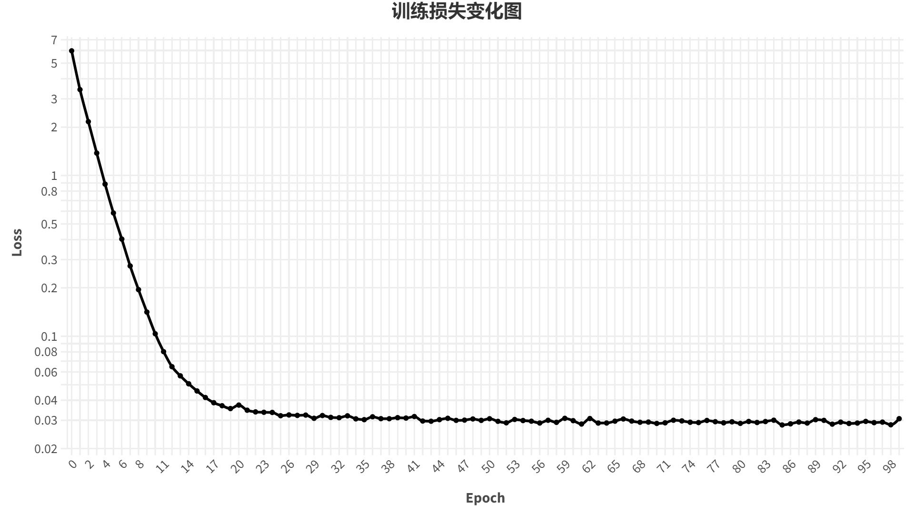
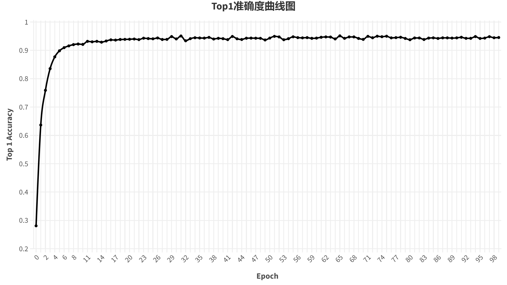
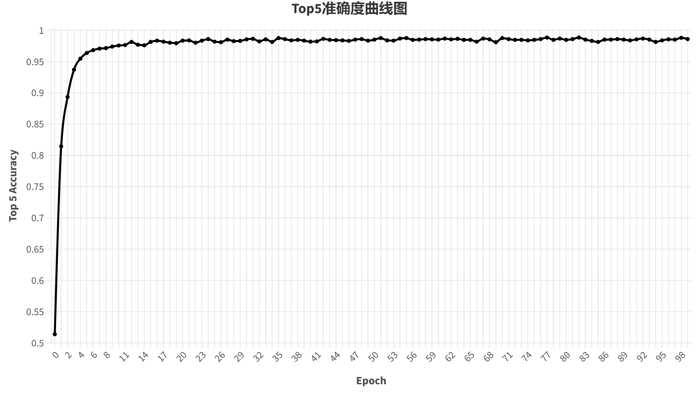

# Palmprint Recognition based on Tongji Contactless Dataset

> Demo project for chapter 2 of "Biometric recognition"
>
> Platform: `Windows 10(22H2)`  
> Graphics Card: `NVIDIA GeForce GTX 1650(4G)`  
> Software: `Python: 3.9.9`, `Pytorch 1.7.1`, `CUDA 11.0+cudnn 8.0.5`

## 🔨 Setting Up

1. Create a new conda environment with python 3.9

    ```shell
    # pwd: .../TJ_Palmprint_Recognition
    conda create -n tj_palm python=3.9
    ```

2. Install the required packages

    ```shell
    # pwd: .../TJ_Palmprint_Recognition
    conda activate tj_palm
    pip install -r requirements.txt
    ```

3. Download the dataset

    > Note: we only use the ROI part of Tongji Dataset
    > 
    > More information can be found in [Dataset page](https://cslinzhang.github.io/ContactlessPalm/)

    ```shell
    # pwd: .../TJ_Palmprint_Recognition

    cd Assets/
    gdown https://drive.google.com/uc?id=1KZCXi6zAk5mZ1nQHFdeYHboAII3DOjls

    mkdir ROI
    # In windows, should install winrar first
    rar x ROI.rar ROI

    # In Linux/Mac, should install unrar first
    unrar x -d ROI ROI.rar
    ```

## 💡 Getting Started

1. Configure the config file: `.../TJ_Palmprint_Recognition/Config/hyp_TJ.json`
   
    > `device`: `cpu` or `cuda:0/1/...`, the device you want to use for training and testing  
    > `num_workers`: `0/1/2/...`, the number of workers for data loading. Set 0 if you are in windows system  
    > `epoch`: `100/200/300/...`, the number of epochs for training  
    > `batch_size`: `16/32/64/...`, the batch size for training, determined by your GPU memory  
    > `lr`: `1e-3/1e-4/...`, the learning rate for training  
    > `weight_decay`: `1e-3/1e-4/...`, the weight decay for training  
    > `momentum`: `0.9/0.8/0.7/...`, the momentum for training

1. Generate dataset

    > Note:   
    > we divide the dataset into 3 parts: `train`, `val`, `test`, and the ratio is `6:2:2`
    >
    > If you want to change the ratio, you need to modify `line 16~18` in `dataset_generate.py`

    ```shell
    # pwd: .../TJ_Palmprint_Recognition
    conda activate tj_palm

    python dataset_generate.py \
    -o Assets/ROI \
    -d Dataset
    ```

2. Train the model: we use `Resnet18` as the backbone

    ```shell
    # pwd: .../TJ_Palmprint_Recognition

    python train.py
    ```
    > Note: while training,
    > 1. The best model will be saved in `.../TJ_Palmprint_Recognition/Results/saved_model/best_<year>-<month>-<day>T<hour>-<minute>.pth`
    > 2. The terminal output will be saved in `.../TJ_Palmprint_Recognition/Results/train_log/train_log_<year>-<month>-<day>T<hour>-<minute>.txt`
    > 3. The tensorboard log will be saved in `.../TJ_Palmprint_Recognition/Results/tb_log`, so you can use the command below to visualize the training process
    >       ```shell
    >       tensorboard --logdir=Results/tb_log
    >       ```

3. Test the model

    ```shell
    # pwd: .../TJ_Palmprint_Recognition

    python test.py \
    -c Config/hyp_TJ.json \
    -w Results/saved_model/best_<year>-<month>-<day>T<hour>-<minute>.pth
    ```

# 🎉 Results

> Top-1 Accuracy: 0.951  
> Top-5 Accuracy: 0.984  

<center>
    
    
    
</center>

# 📃 License

This project follows the [MIT](LICENSE) license. Without the permission of the project owner, the project can only be used for academic and personal research and cannot be used for any purpose that may be considered commercial.

